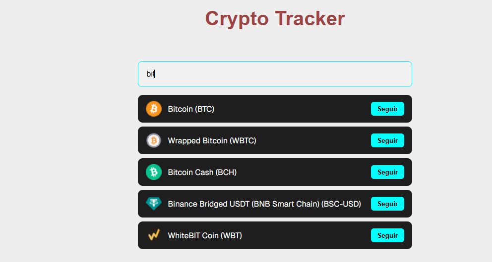
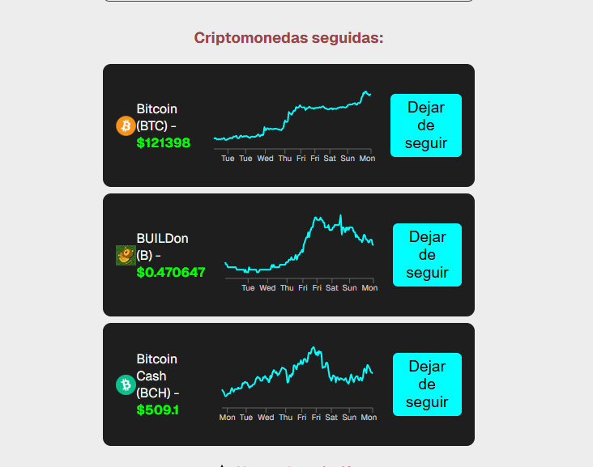
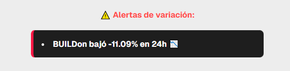

## Desafio Crypto Tracker
Esta aplicación fue desarrollada como solución al desafio Crypto Tracker.

## Descripción 
**Cryto Tracker** es una app que permite a los usuarios buscar criptomonedas, seguirlas, visualizar su precio actualizado cada cuarenta y cinco segundos(45) y recibir las alertas si el precio sube o baja significativamente (+-5%). Inclui una grafica con la evolución de los ultimos siete (7) días para cada criptomoneda seguida.

## Tecnologias Utilizadas
- [Next.js 15](https://nextjs.org/) (App Router)
- [React 19](https://reactjs.org/)
- [Styled components](https://styled-components.com/) - Para los estilos
- [Axios](https://axios-http.com/) - Para las llamadas HTTP
- [Recharts](https://recharts.org/en-US) -  Para los gráficos de línea
- API de [CoinGecko](https://www.coingecko.com/en/api) - Para datos y precios

## Capturas de pantalla del proyecto

## Buscador y lista de resultados:


## Lista de criptomonedas seguidas:


## Alertas visuales:


## Como ejecutar el proyecto localmente

## Clonar este repositorio
https://github.com/alejom21/cripto-tracker.git
cd crypto-tracker

## Instala las dependencias
```bash
npm install
```

## Ejecución en el servidor en desarrollo
```bash
npm run dev
```

Accede a http://localhost:3000

## Hosting del proyecto
El proyecto está desplegado en Vercel


## Estructura del proyecto

src/
|-- app/            -> Estructura base de Next.js (Layout, Page)
|-- components/     -> Componentes (Header, PriceChart, SearchBar)
|-- lib/            -> Registry.js para SSR de styled-components
|-- styles/         -> GlobalStyles.js (Estilos globales)


## Funcionalidades Claves
-> Buscar Criptomonedas por nombre.
-> Seguir Criptomonedas de preferencia.
-> Eliminar Criptomonedas de la lista de preferencias.
-> Ver precios actualizados automaticamente cada cuarenta y cinco segundos (45s).
-> Alertas visuales si hay variaciones importantes (+-5%).
-> Grafico de los ultimos siete (7) días por cada moneda seguida.

## Notas Importantes
-> Las graficas usan setTimeout con delay aleatorio para evitar sobrecarga de la API de CoinGecko.


## Autor
Alejandro Mejia Tabares


